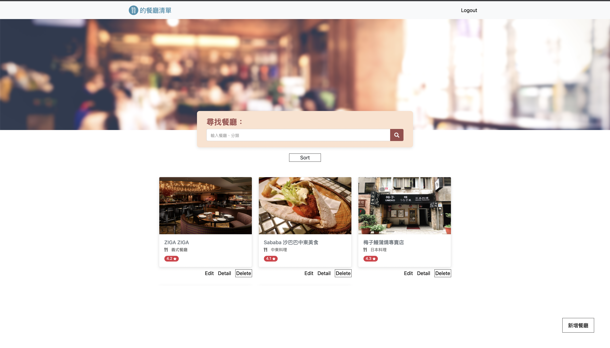
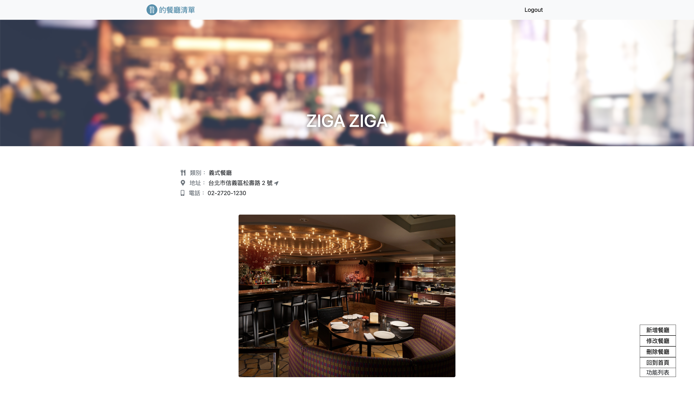
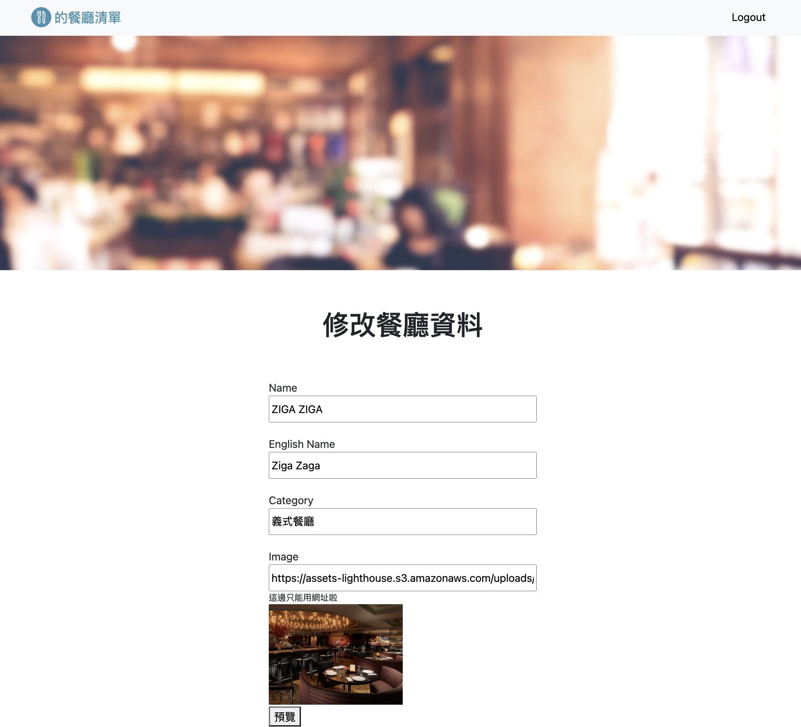
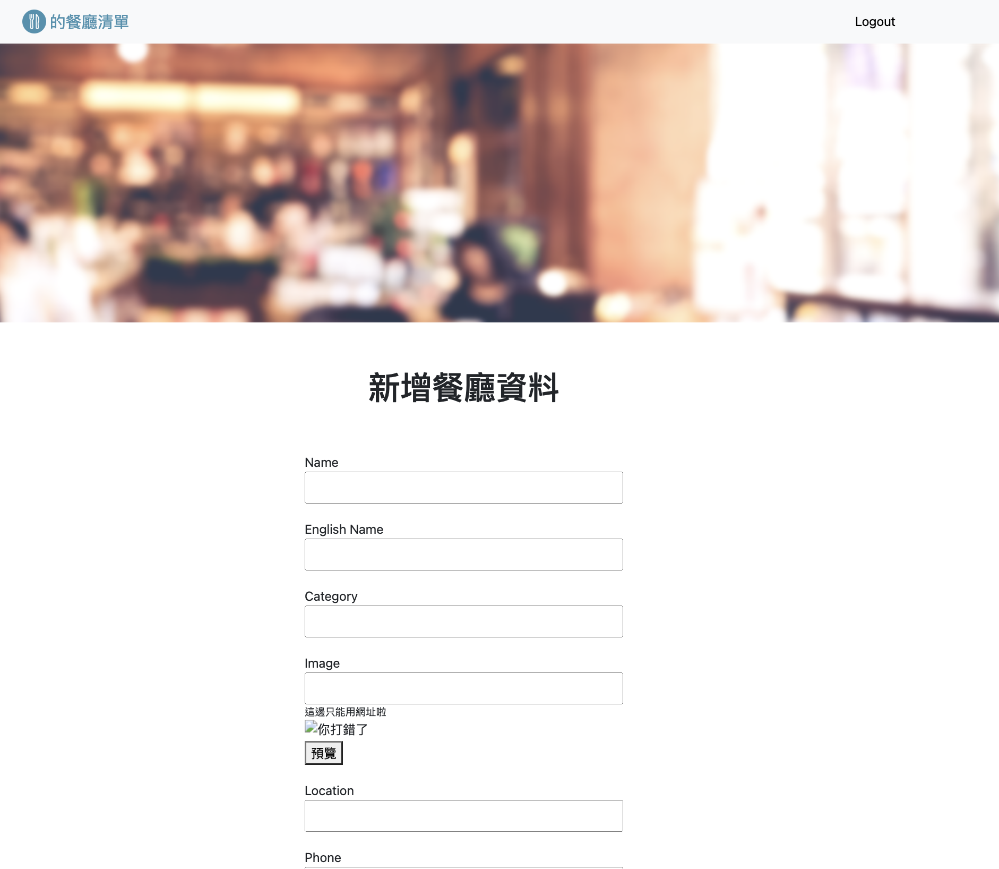
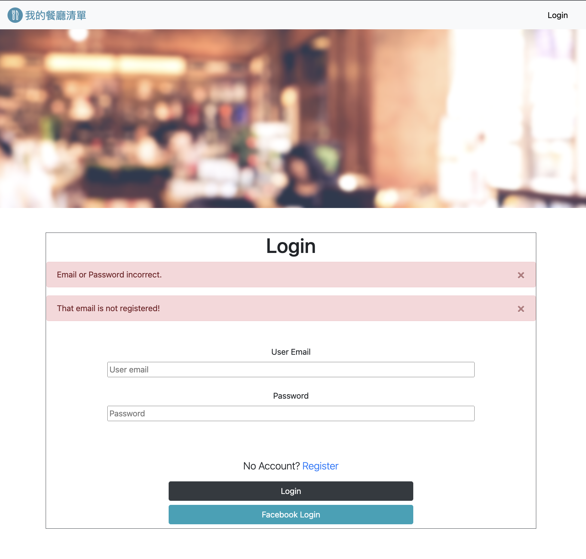
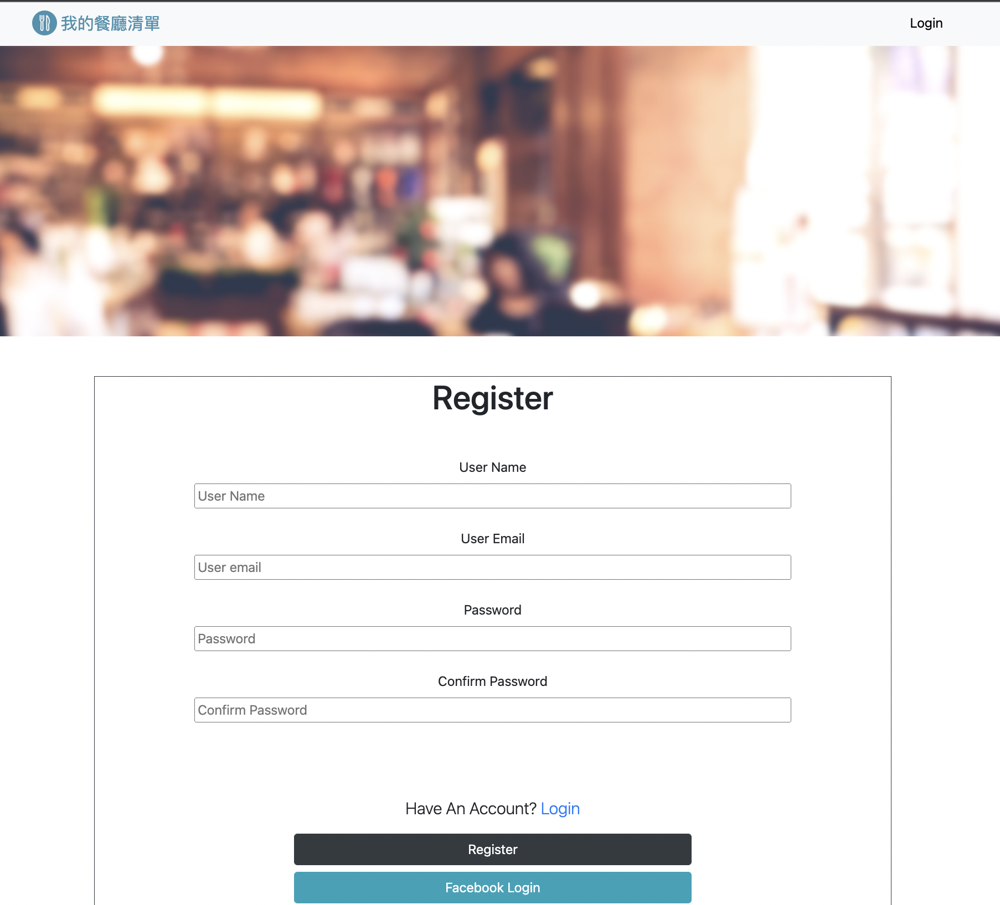

# ac_restaurant_list
使用者登錄後可以紀錄餐廳資料的網頁。


### Function list
- 使用者可以用email建立帳號
- 使用者可以用Facebook帳號直接登陸
- 使用者可以使用帳號登入
- 使用者可以瀏覽所有餐廳
- 使用者可以新增餐廳
- 使用者可以閱讀餐廳詳細資料
- 使用者可以修改餐廳資料
- 使用者可以刪除餐廳資料


### Installing

需要下列環境
```
node.js
Python 3

npm 套件 :
  "bcryptjs": "^2.4.3",
  "connect-flash": "^0.1.1",
  "dotenv": "^8.2.0",
  "express": "^4.17.3",
  "express-handlebars": "^3.1.0",
  "express-session": "^1.17.1",
  "method-override": "^3.0.0",
  "mongoose": "^6.2.6",
  "node-sass-middleware": "^1.0.1",
  "passport": "^0.4.1",
  "passport-facebook": "^3.0.0",
  "passport-local": "^1.0.0"

資料庫 :
  MongoDB
```
開啟終端機(Terminal)，cd到存放專案本機位置並執行
```
git clone https://github.com/eruc1117/ac_restaurant_list.git
```
下載專案後再次cd到ac_restaurant_list，再往下進行<br>

安裝套件 
```
npm install
```

設定環境檔案
```
npm run env
```
在terminal中輸入名稱
目前可設定
FACEBOOK_ID
FACEBOOK_SECRET
資料庫名稱(預設mongodb://localhost/' + 資料庫名稱)

製作種子資料
```
npm run seed
```

運行主程式
```
npm run dev
```
將terminal顯示的localhost:3000貼到網頁上執行

## data format
user:
- name
- email
- password
- confirm password

restaurant:
- id
- name
- name_english
- category
- image
- location
- phone
- google_map
- rating
- description
- sameName:
- userId

## Running the tests

顯示餐廳清單


顯示餐廳詳細資料，右下角增加功能列


顯示edit頁面


顯示new頁面


顯示登入頁面


顯示註冊畫面
